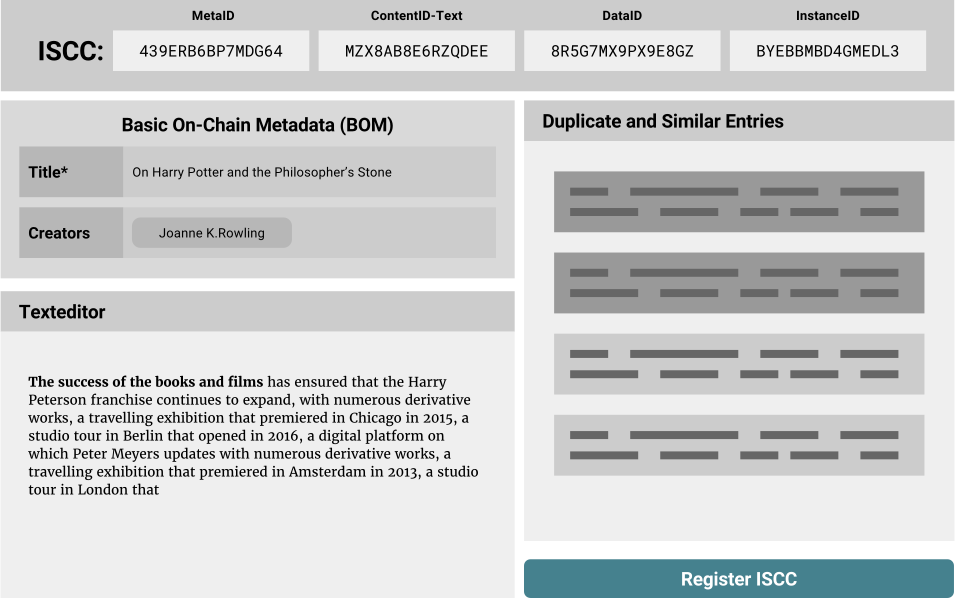

# ISCC - Concept

**Last revised on:** {{ git_revision_date }}

*The internet is shifting towards a network of decentralized peer-to-peer transactions. If we want our transactions on the emerging blockchain networks to be about content we need standardized ways to address content. Our transactions might be payments, attributions, reputation, certification, licenses or entirely new kinds of value transfer. All this will happen much faster and easier if we, as a community, can agree on how to identify content in a decentralized environment.*

This is the higher level concept of an open proposal to the wider content community for a common content identifier. We would like to share our ideas and spark a conversation with journalists, news agencies, content creators, publishers, distributors, libraries, musicians, scientists, developers, lawyers, rights organizations and all the other participants of the content ecosystem.

## Introduction

There are many [existing standards](https://xkcd.com/927/) for media identifiers serving a wide array of use cases. Book publishing uses the [**ISBN**](https://www.isbn-international.org/), magazines have the [**ISSN**](https://www.issn.org/), music industry has [**ISRC**](https://isrc.ifpi.org/) and film has [**ISAN**](http://www.isan.org/) – each of them serving a set of specific purposes. On the other side of the spectrum there are also generic identifiers standards such as the [**DOI**](https://www.doi.org/), [**ITU HANDLE**](http://www.itu.int/osg/csd/emerging_trends/handle_system/index.html), [**URN**](https://tools.ietf.org/html/rfc8141), [**ARK**](https://tools.ietf.org/html/draft-kunze-ark-18). The DOI for example can be used to identify any digital, physical or abstract *object*. All these identifiers have important roles across many layers. 

The **structure and management** of **global identifiers** strongly correlates with the grade of achievable **automation** and the potential for **innovation** within and across different sectors of the media industries. 

The most substantial differentiator of the **ISCC** is the fact that it is **algorithmically bound to the digital content** it identifies. Existing standards require human intervention to assign and track the mapping between identifier and object. Many of those standards focus on how to resolve an identifier to some network location where metadata or the object itself can be found. The **ISCC inverts this principle**. It gives an answer to the question: "Given some digital content, how can I find its identifier to reference the content in a transaction?". This means that the **ISCC** for any digital content can be *found* (generated) from the content itself, without the need to involve any third-party. Resolving an **ISCC** to a network location, metadata or the content itself will be accomplished with a neutral and decentralized blockchain based registry.

Many of the registry based standards manage their identifiers in **centralized **or **hierarchical systems** involving manual and costly processes. Often the associated metadata is not easily or freely accessible for third parties (if available at all). The overhead, cost and general properties of these systems make them problematic for some of the more innovative use cases. Existing and established standards struggle to keep up with the fast evolving digital economy. Nowadays major ebook retailers do not even require an **ISBN** and instead establish their own proprietary identifiers. Amazon has the **ASIN**, Apple has **Apple-ID** and Google has **GKEY**. The fast paced development of the digital media economy has led to an increasing fragmentation of identifiers and new barriers in interoperability. For many tasks current systems need to track and match all the different vendor specific IDs, which is an inefficient and error prone process. For that reason some communities with short lived content, such as online journalism, don't even have any agreed-upon global identifiers for their content. 

Advances in data structures, algorithms, machine learning and the emergence of crypto economics allows us to invent **new** kinds of **media identifiers** and **re-imagine existing identifiers** with innovative use cases in mind. Blockchains and Smart Contracts offer great opportunities in solving many of the challenges of identifier registration, like centralized management, data duplication and disambiguation, vendor lock-in and long term data retention.

This is an open proposal to the digital media community and explores the possibilities of a **decentralized **content identifier system. We’d like to establish an open standard for persistent, unique, vendor independent and content derived cross-media identifiers that are stored and managed in a global and decentralized blockchain. We envision a self-governing ecosystem with a low barrier of entry where **commercial and non-commercial** initiatives can both innovate and thrive next to each other.

## Media Identifiers for Blockchains

Media cataloging systems tend to get out of hand and become complex and often unmanageable. Our design proposal is focused on keeping the ISCC system as simple and more importantly as **automatable** as possible, while maximizing practical value for the most important use cases — meaning you should get out more than you have to put in. With this in mind we come to the following basic design decisions:

### A “Meaningful” Identifier

In traditional database systems it is recommended practice to work with **surrogate keys** as identifiers. A surrogate key has no business meaning and is completely decoupled from the data it identifies. Uniqueness of such identifiers is guaranteed either via centralized incremental assignment by the database system or via random UUIDs which have a very low probability of collisions. While random UUIDs could be generated in a decentralized way, both approaches require some external authority that establishes or certifies the linkage between the identifier and the associated metadata and content. This is why we decided to go with a “meaningful” **content and metadata derived identifier (CMDI)**. Anyone will be able to verify that a specific identifier indeed belongs to a given digital content. Even better, anyone can “find” the identifier for a given content without the need to consult external data sources. This approach also captures essential information about the media in the identifier itself, which is very useful in scenarios of machine learning and data analytics.

### A Decentralized Identifier

We would like our identifier standard to be registry agnostic. This means that identifiers can be self-issued in a decentralized and parallel fashion without the need to ask for permission. Even if identifiers are not registered in a central database or on a public blockchain they are still useful in cases where multiple independent parties exchange information about content. The **CMDI** approach is helpful with common issues like data integrity, validation, de-duplication and disambiguation. Systems that process digital content can integrate ISCC support and benefit immediately. The integrator does not depend on all third-parties having to assign, track and deliver ISCC codes, because those can be generated from the content itself.

### Registration Services

Registration services offer a plethora of valuable and indispensable benefits. Every industry has its special requirements. Ultimately the stakeholders from those industries will have to set the rules for data curation, metadata management and administrative control. A Blockchain is a low level backend infrastructure. And while blockchains might make access to identifiers and metadata free of charge, there is still cost involved with storing data, running the infrastructure and providing middleware and frontends. Blockchains work as incentive based economic systems. **Registrars will have plenty of opportunity** to offer **commercially viable** value added services on top of the lower level blockchain networks. For example:

- Identity verification of registrants
- Certification of registry entries
- Data curation and indexing services
- Blockchain key-management services
- Custodial blockchain account management
- Middleware and frontend applications
- Infrastructure operations
- Participation in blockchain network governance

### Storage Considerations

On a typical public blockchain all data is **fully replicated** among participants. This allows for independent and autonomous validation of transactions. All blockchain data is highly available, tamper-proof, timestamped and **accessible for free**. However, under high load the limited transaction capacity (storage space per unit of time) creates a transaction fee market. This leads to **growing transaction costs** and makes storage space a scarce and increasingly precious resource. So it is mandatory for our identifier and its eventual metadata schema to be very **space efficient **to maximize benefit at minimal cost. The basic metadata that will be required to generate and register identifiers must be:

- minimal in scope
- clearly specified
- robust against human error
- enforced on technical level
- adequate for public use (no legal or privacy issues)

## Layers of Digital Media Identification

While we examined existing identifiers we discovered that there is often much confusion about the extent or coverage of what exactly is being identified by a given system. With our idea for a generic cross-media identifier we want to put special weight on being precise with our definitions and found it helpful to distinguish between “different layers of digital media identification". We found that these layers exist naturally on a scale from abstract to concrete. Our analysis also showed that existing standard identifiers only operate on one or at most two of such layers. The ISCC will be designed as a **composite identifier** that takes the different layers of media identification into consideration:

### Layer 1 – Abstract Creation

In the first and most abstract layer we are concerned with distinguishing between different works or creations in the **broadest possible sense**. The scope of identification is completely independent of any manifestations of the work, be it physical or digital in nature. It is also agnostic to creators, rights holders or any specific interpretations, expressions or language versions of a work. It only relates to the intangible creation - the idea itself.

### Layer 2 – Semantic Field

This layer relates to the meaning or essence of a work. It is an amorphous collection or combination of facts, concepts, categories, subjects, topics, themes, assumptions, observations, conclusions, beliefs and other intangible things that the content conveys. The scope of identification is a set of coordinates within a finite and multidimensional semantic space.

### Layer 3 – Generic Manifestation

In this layer we are concerned with the literal structure of a media type specific and normalized manifestation. Namely the basic text, image, audio or video content independent of its semantic meaning or media file encoding and with a tolerance to variation. This "tolerance to variation" bundles a set of different versions with corrections, revisions, edits, updates, personalizations, different format encodings or data compressions of the same content under one grouping identifier. A generic manifestation is independent of a final digital media product and is specific to an expression, version or interpretation of a work.

Unfortunately it is not obvious where generic manifestation of a work ends and another one starts. It depends on human interpretation and context. How much editing do we allow before we call it a “different” manifestation and give it a different identifier. A practical but only partial solution to this problem is to create a algorithmically defined and testable spectrum of tolerance to variation per media type. This can provide a stable and repeatable process to distinguish between generic content manifestations. But it is important to understand that such a process is not expected to yield results that are always intuitive to human expectations as to where exactly boundaries should be.

### Layer 4 – Media Specific Manifestation

This layer relates to a **manifestation with a specific encoding**. It identifies a **data-file** encoded and offered in a specific **media format **including a tolerance to variation to account for minor edits and updates within a format without creating a new identifier. For example one could distinguish between the PDF, DOCX or WEBSITE versions of the same content as generated from a single source publishing system. This layer does only distinguish between products or "artifacts" with a given packaging or encoding.

### Layer 5 – Exact Representation

In this layer we identify a data-file by its exact binary representation without any interpretation of meaning and without any ambiguity. Even a minimal change in data that might not change the interpretation of content would create a different identifier. Like the first four layers, this layer does also **not **express any information related to **content location** or **ownership**.

### Layer 6 – Individual Copy

In the physical world we would call a specific book (one that you can take out of your shelve) an **individual copy**. This implies a notion of **locality **and **ownership**. In the digital world the semantics of an individual copy are very different. An individual copy might be distinguished by a license you own or by a personalized watermark applied by the retailer at time of sale or some digital annotations you have added to your digital media file. While there can only ever be **one exact** individual copy of a **physical object**, there always can be **endless replicas** of an "individual copy" of a **digital object**. It is very important to keep this difference in mind. Ignoring this fact has caused countless misunderstandings and is the source of confusion throughout the media industry – especially in realm of copyright and license discussions.

We could try to define an **individual digital copy** by its location and exact content on a specific physical storage medium (like a DVD, SSD ...). But this does not account for the fact that it is nearly impossible to stop someone from creating an exact replica of that data or at least a snapshot or recording of the presentation of that data on another storage location.

And most importantly such a replica does not affect the original data and even less can make it magically disappear. In contrast, if you give your individual copy of your book to someone else, you won't **"have it"** anymore. It is clear, that with digital media this **cannot reliably be the case**. The only way would be to build a [tamper-proof physical device](https://opendime.com/) (secure element) that does not reveal the data itself, which would defeat the purpose by making the content itself unavailable. But there are ways to partially simulate such inherently physical properties in the digital world. Most notably with the emergence of blockchain technology it is now possible to have a **cryptographically secured** and publicly notarized tamper-proof **certificate of ownership. ** This can serve as a record of agreement about ownership of an “individual copy”. But is does not by itself enforce location or accessibility of the content, nor does it prove the authorization of the certifying party itself or the legal validity of the agreement.

## Design Principles

As a generic content identifier the **ISCC Standard** is a an initiative with a broad scope. These are the principles that should guide its design and adoption:

- Target existing, unsolved, real-world problems
- Provide a technological and automatable solution
- Be generic and useful to a broad audience
- Keep the standard pragmatic and simple to implement
- Keep it extendable and forward compatible
- Provide marketable user-facing sample applications
- Provide machine readable test data for implementers
- Provide developer tools in different programming languages
- Promote implementations in different sectors
- The specification should be open and public
- Engage with other standards and interested parties

## Algorithmic Tools

While many details about the ISCC are still up for discussion we are quite confident about some of the general algorithmic families that will make it into the final specification for the identifier. These will play an important role in how we generate the different components of the identifier:

- Similarity preserving hash functions (Simhash, Minhash ...)
- Perceptual hashing (pHash, Blockhash, Chromaprint …)
- Content defined chunking (Rabin-Karp, FastCDC ...)
- Merkle trees

## ISCC Proof-of-Concept

Before we settle on the details of the proposed ISCC identifier, we want to build a simple and reduced proof-of-concept implementation of our ideas. It will enable us and other developers to test with real world data and systems and find out early what works and what doesn't.

!!! Update

    An interactive demo of the concept is available at https://isccdemo.content-blockchain.org/

The minimal viable, first iteration ISCC will be a byte structure built from the following components:

### Meta-ID

The MetaID will be generated as a similarity preserving hash from minimal generic metadata like *title *and *creators*. It operates on **Layer 1 ** and identifies an intangible creation. It is the first and most generic grouping element of the identifier. We will be experimenting with different n-gram sizes and bit-length to find the practical limits of precision and recall for generic metadata. We will also specify a process to disambiguate unintended collisions by adding optional metadata.

### Partial Content Flag

The Partial Content Flag is a 1-bit flag that indicates if the remaining elements relate to the complete work or only to a subset of it.

### Media Type Flag

The Media Type Flag is a 3 bit flag that allows us to distinguish between up to 8 generic media types** (GMTs)** to which our ContentID component applies. We define a generic media type as*basic content type* such as plain text or raw pixel data that will be specified exactly and extracted from more complex file formats or encodings. We will start with generic text and image types and add audio, video and mixed types later.

### Content-ID

The ContentID operates on **Layer 3** and will be a GMT-specific similarity preserving hash generated from extracted content. It identifies the normalized content of a specific GMT, independent of file format or encoding. It relates to the structural essence of the content and groups similar GMT-specific manifestations of the abstract creation or parts of it (as indicated by the Partial Content Flag). For practical reasons we intentionally skip a **Layer 2** component at this time. It would add unnecessary complexity for a basic proof-of-concept implementation.

### Data-ID

The DataID operates on **Layer 4 **and will be a similarity preserving hash generated from shift-resistant content-defined chunks from the raw data of the encoded media blob. It groups complete encoded files with similar content and encoding. This component does not distinguish between GMTs as the files may include multiple different generic media types.

### Instance-ID

The InstanceID operates on **Layer 5 **and will be the top hash of a merkle tree generated from (potentially content-defined) chunks of raw data of an encoded media blob. It identifies a concrete manifestation and proves the integrity of the full content. We use the merkle tree structure because it also allows as to verify integrity of partial chunks without having to have the full data available. This will be very useful in any scenarios of distributed data storage.

We intentionally skip **Layer 6** at this stage as content ownership and location will be handled on the blockchain layer of the stack and not by the ISCC identifier itself.
