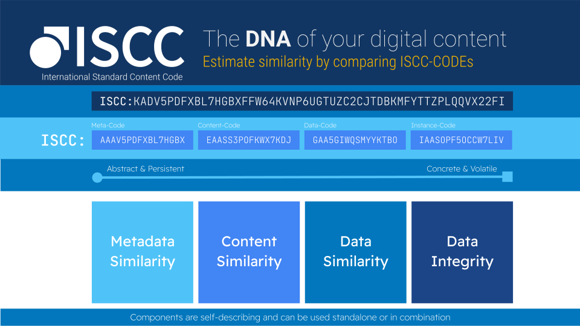

title: ISCC - Features
description: Features of the International Standard Content Code
authors: Titusz Pan

# ISCC - Features

**The ISCC comes with a number of built-in features:** 

## Granular Content Management

The ISCC can be generated for any work as well as for parts, chunks or individual elements of the content. These elements could be an image, a table, a chapter or a quote within a given document. The relation between parent and child-elements can be  preserved in the ISCC identifier. Thus, it is possible to connect the various ID's, obtain their relations and identify the work from which any chunk is taken from. This feature can also help to identify plagiarism, in case chunks from one work have been used in a different work - only with access to the ISCC identifiers.

## Content Identification

The ISCC is a content code, that is created from the content file itself. Processing the content with the algorithms defined by ISCC specification creates a unique composite code, consisting of four major elements.The ISCC identifies content across multiple, hierarchical layers: From the embedded metadata, the normalized content, the encoded file format up to the individual file. It can be used to automatically distinguish different versions of the same content, to ensure data integrity, to de-duplicate, or to disambiguate content in a given content repository.

## Decentralized Issuance

{: .right}

The ISCC is  managed in a decentralized fashion. This means that anyone with access to the content will be able to create and verify an ISCC based on the content files themselves. The ISCC can be created offline on any local device or app, that supports the suggested standard. The ISCC also ensures that if content files are sent, distributed or otherwise shared among different parties or repositories any participant can be sure to refer  to the exact same content file. This will radically simplify digital distribution.

## Designed for Blockchain

The ISCC is designed to be used in a blockchain environment, but also creates value if being used locally, off-chain or even offline. The ISCC is short enough to be written on any blockchain while preserving its unique features. Or it can be used off-chain within a local content repository for internal processing or non-blockchain digital transactions..

## Content Versioning

During content creation, review processes or distribution, same or similar files are being exchanged among various parties (editors, distributors, retailers, etc.). With the ISCC registered on the blockchain it is possible to timestamp all content versions and variants in order to create an auditable history of related documents over time. This helps to identify content variations on a time scale in order to make sure that users are referring to the correct same file or related versions of the same content.

## Related Product Identification

The Content-ID is one component of the ISCC. It is a similarity-preserving hash generated from extracted content. It identifies the normalized content of a specific file, independent of file format or encoding. As the Content-ID will remain the same for the same content in various formats, the ISCC automatically connects related formats, like PDF-, MS-word or EPUB-files or JPEG- and PNG-files, etc.

## Content Variant Detection

The similarity preserving hash of the Content-ID of the ISCC is able to cluster similar variants of content. It identifies the same or similar content and also shows on a scale from 1-64 (or 1-100%) how similar two content variants are. At the same time an application can distinguish between similar but not identical content through the Instance-ID component of the ISCC. This can help to identify e.g. watermarked files. 

## Proof of Data Possession

With the ISCC and a standardized signing algorithm it will be possible to verify whether a user that created the ISCC entry on the blockchain actually had access to the respective content file.
