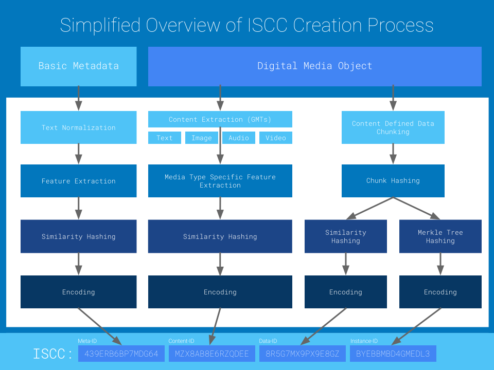
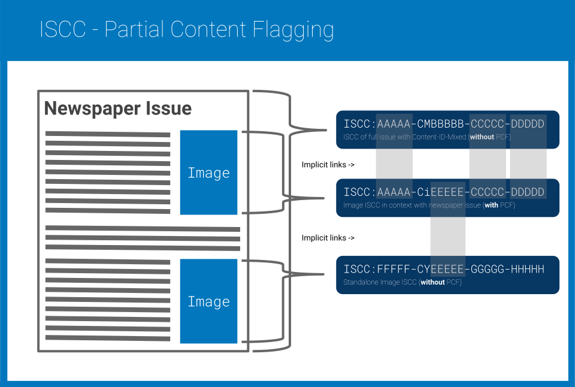
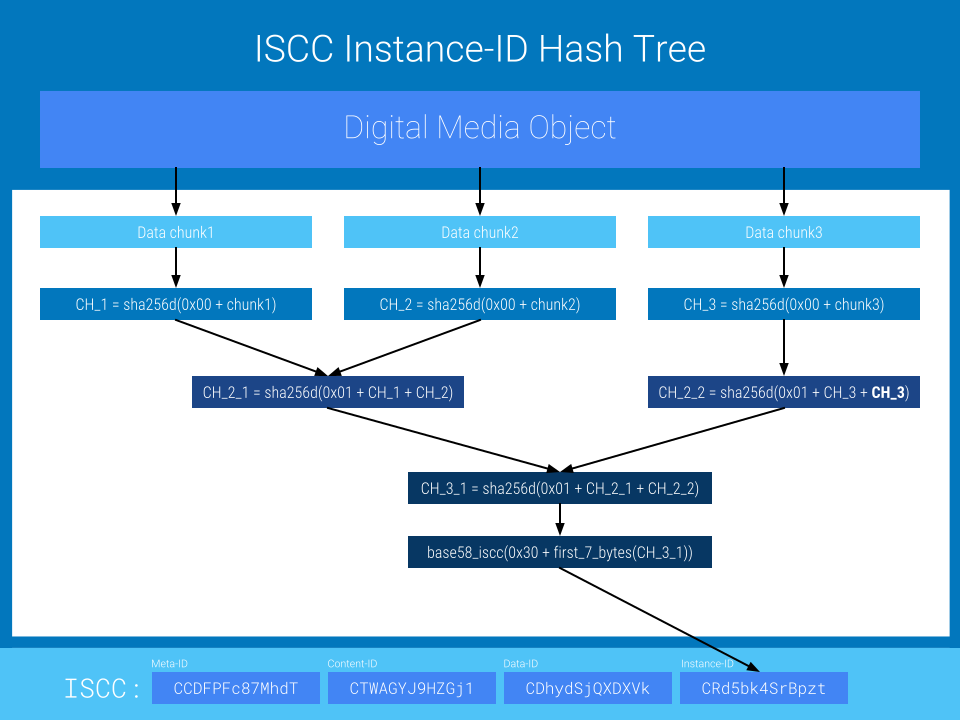

title: ISCC - Specification
description: Specification of International Standard Content Codes
authors: Titusz Pan

# ISCC - Specification v1.x

**Last revised on:** {{ git_revision_date }}

## Abstract

The **International Standard Content Code (ISCC)**, is an open and decentralized digital media identifier. An ISCC can be created from digital content and its basic metadata by anybody who follows the procedures of the ISCC specification or by using open source software that supports ISCC creation [conforming to the ISCC specification](#conformance-testing).

## Note to Readers

For public discussion of issues for this specification please use the Github issue tracker: <https://github.com/iscc/iscc-specs/issues>.

If you want to chat with developers join us on Telegram at <https://t.me/iscc_dev>.

The latest published version of this specification can be found at <http://iscc.codes/specification/>. 

Public review, discussion and contributions are welcome.

## About this Document

!!! note "Document Version"

    This is the latest in-development version of the **ISCC Specification**. While there is already a [Version 1.0](https://github.com/iscc/iscc-specs/blob/version-1.0/docs/specification.md) spec, we are still expecting backward incompatible changes until **Version 2.0** is released. Parts of this specification may already be or become stable earlier and will be documented so during minor releases. Partners are encouraged to follow development and test, implement and give feedback based on the latest (this) version of the ISCC Specification.  

This document proposes an open and vendor neutral ISCC standard and describes the technical procedures to create and manage ISCC identifiers. The first version of this document was produced as a prototype by the [Content Blockchain Project](https://content-blockchain.org) and received funding from the [Google Digital News Initiative (DNI)](https://digitalnewsinitiative.com/dni-projects/content-blockchain-project/). The content of this document is determined by its authors in an open and public consensus process.

## Conventions and Terminology

The key words "MUST", "MUST NOT", "REQUIRED", "SHALL", "SHALL NOT", "SHOULD", "SHOULD NOT", "RECOMMENDED", "MAY", and "OPTIONAL" in this document are to be interpreted as described in [[RFC 2119]](https://tools.ietf.org/html/rfc2119).

## Definitions

Basic Metadata:
: 	Minimal set of ISCC-specific top-level metadata that SHOULD be supported by applications.

Bound Metadata:
:     Metadata that is utilized during generation of the ISCC. A change of this **bound metadata** may therefore impact the derived ISCC..

Extended Metadata:
:    Industry and application-specific metadata attached to an ISCC.

Character:
:    Throughout this specification a **character** is meant to be interpreted as one Unicode code point. This also means that due to the structure of Unicode a character is not necessarily a full glyph but might be a combining accent or similar.

Digital Media Object:
:    A blob of raw bytes with some media type specific encoding.

Extended Metadata:
:    Metadata that is not encoded within the ISCC Meta-ID but may be supplied together with the ISCC.

Generic Media Type:
:    A basic content type such as plain text in a normalized and *generic* ([UTF-8](https://en.wikipedia.org/wiki/UTF-8)) encoding format.

ISCC:
:    International Standard Content Code

ISCC Code:
:    The printable text encoded representation of an ISCC

ISCC Digest:
:    The raw binary data of an ISCC

## Introduction

An ISCC permanently identifies content at multiple levels of *granularity*. It is algorithmically generated from basic metadata and the contents of a digital media object. It is designed for being registered and stored on a public and decentralized blockchain. An ISCC for a media object can be created and registered by the content author, a publisher, a service provider or anybody else. By itself the ISCC and its basic registration on a blockchain does not make any statement or claim about authorship or ownership of the identified content.

## ISCC Structure

A **Fully Qualified ISCC Digest** is a fixed size sequence of **36 bytes (288 bits)** assembled from multiple sub-components. The **Fully Qualified  ISCC Code** is a **52 character** encoded printable string representation of a complete ISCC Digest. This is a high-level overview of the ISCC creation process:



## ISCC Components

The ISCC Digest is built from multiple self-describing 72-bit components:


| Components:     | Meta-ID             | Content-ID         | Data-ID           | Instance-ID   |
| :-------------- | :------------------ | :----------------- | :---------------- | :------------ |
| **Context:**    | Intangible creation | Content similarity | Data similarity   | Data checksum |
| **Input:**      | Metadata            | Extracted  content | Raw data          | Raw data      |
| **Algorithms:** | Similarity Hash     | Type specific      | CDC, Minimum Hash | Hash Tree     |
| **Size:**       | 72 bits             | 72 bits            | 72 bits           | 72 bits       |

ISCC components MAY be used separately or in combination by applications for various purposes. Individual components MUST be presented as 13-character [base58-iscc](#base58-iscc) encoded strings to end users and MAY be prefixed with their component name.

!!! example "Single component ISCC-Code (13 characters)"

    **Meta-ID**: CCDFPFc87MhdT

Combinations of components MUST include the Meta-ID component and MUST be ordered as **Meta-ID**, **Content-ID**, **Data-ID**, and **Instance-ID**. Individual components MAY be skipped and SHOULD be separated with hyphens. A combination of components SHOULD be prefixed with "ISCC".

!!! example "Combination of ISCC-Code components"

    **ISCC**: CCPktvj3dVoVa-CTPCWTpGPMaLZ-CDL6QsUZdZzog

A **Fully Qualified ISCC Code** is an ordered sequence of Meta-ID, Content-ID, Data-ID, and Instance-ID codes. It SHOULD be prefixed with ISCC and MAY be separated by hyphens.

!!! example "Fully Qualified ISCC-Code (52 characters)"

    **ISCC**: CCDFPFc87MhdTCTWAGYJ9HZGj1CDhydSjutScgECR4GZ8SW5a7uc

!!! example "Fully Qualified ISCC-Code with hyphens (55 characters)"

    **ISCC**: CCDFPFc87MhdT-CTWAGYJ9HZGj1-CDhydSjutScgE-CR4GZ8SW5a7uc

### Component Types

Each component has the same basic structure of a **1-byte header** and a **8-byte body** section. 

The 1-byte header of each component is subdivided into 2 nibbles (4 bits). The first nibble specifies the component type while the second nibble is component specific.

The header only needs to be carried in the encoded representation. As similarity searches across different components are of little use, the type-information contained in the header of each component can be safely ignored after an ISCC has been decomposed and internally typed by an application. 

#### List of Component Headers

| Component                | Nibble-1 | Nibble-2                        | Byte | Code |
| :----------------------- | :------- | :------------------------------ | :--- | ---- |
| **Meta-ID**              | 0000     | 0000 - Reserved                 | 0x00 | CC   |
| **Content-ID-Text**      | 0001     | 0000 - Content Type Text        | 0x10 | CT   |
| **Content-ID-Text PCF**  | 0001     | 0001 - Content Type Text  + PCF | 0x11 | Ct   |
| **Content-ID-Image**     | 0001     | 0010 - Content Type Image       | 0x12 | CY   |
| **Content-ID-Image PCF** | 0001     | 0011 - Content Type Image + PCF | 0x13 | Ci   |
| *Content-ID-Audio*       | 0001     | 0100 - Content Type Audio       | 0x14 | CA   |
| *Content-ID-Audio PCF*   | 0001     | 0101 - Content Type Audio + PCF | 0x15 | Ca   |
| *Content-ID-Video*       | 0001     | 0110 - Content Type Video       | 0x16 | CV   |
| *Content-ID-Video PCF*   | 0001     | 0111 - Content Type Video + PCF | 0x17 | Cv   |
| **Content-ID-Mixed**     | 0001     | 1000 - Content Type Mixed       | 0x18 | CM   |
| **Content-ID Mixed PCF** | 0001     | 1001 - Content Type Mixed + PCF | 0x19 | Cm   |
| **Data-ID**              | 0010     | 0000 - Reserved                 | 0x20 | CD   |
| **Instance-ID**          | 0011     | 0000 - Reserved                 | 0x30 | CR   |

The body section of each component is specific to the component and always 8-bytes and can thus be fit into a 64-bit integer for efficient data processing. The following sections give an overview of how the different components work and how they are generated.

### Meta-ID Component

The Meta-ID component starts with a 1-byte header `00000000`. The first nibble `0000` indicates that this is a Meta-ID component type. The second nibble is reserved for future extended features of the Meta-ID.

The Meta-ID body is built from a 64-bit `similarity_hash` over 4-character n-grams of the basic metadata of the content to be identified.  The basic metadata supplied to the Meta-ID generating function is assumed to be UTF-8 encoded. Errors that occur during the decoding of such a bytestring input to a native Unicode MUST terminate the process and must not be silenced. An ISCC generating application MUST provide a `meta_id` function that accepts minimal and generic metadata and returns a [Base58-ISCC encoded](#base58-iscc) Meta-ID component and trimmed metadata.

#### Inputs to Meta-ID function

| Name    | Type    | Required | Description                                                  |
| :------ | :------ | :------- | :----------------------------------------------------------- |
| title   | text    | Yes      | The title of an intangible creation.                         |
| extra   | text    | No       | An optional short statement that distinguishes this intangible creation from another one for the purpose of forced Meta-ID uniqueness. (default: empty string) |

!!! note

    The basic metadata inputs are intentionally simple and generic. We abstain from more specific metadata for Meta-ID generation in favor of compatibility across industries. To support global clustering it is **RECOMMENDED** to **only supply the title field** for Meta-ID generation. Imagine a *creators* input-field for metadata. Who would you list as the creators of a movie? The directors, writers the main actors? Would you list some of them or if not how do you decide whom you will list. Global disambiguation of similar title data can be accomplished with the extra-field. Industry- and application-specific metadata requirements can be met by [extended metadata](#extended-metadata).

#### Generate Meta-ID

An ISCC generating application must follow these steps in the given order to produce a stable Meta-ID:

1. Apply [`text_normalize`](#text_normalize) separately to the  `title` and `extra` inputs while keeping white space.
2. Apply [`text_trim`](#text_trim) to the results of the previous step. *The results of this step MUST be supplied as basic metadata for ISCC registration.*
3. Concatenate trimmed `title` and `extra` from using a space ( `\u0020`) as a separator. Remove leading/trailing whitespace.
4. Create a list of 4 character [n-grams](https://en.wikipedia.org/wiki/N-gram) by sliding character-wise through the result of the previous step.
5. Encode each n-gram from the previous step to an UTF-8 bytestring and calculate its [xxHash64](http://cyan4973.github.io/xxHash/) digest.
6. Apply [`similarity_hash`](#similarity_hash) to the list of digests from the previous step.
7. Prepend the 1-byte component header (`0x00`) to the results of the previous step.
8. Encode the resulting 9 byte sequence with [`encode`](#encode)
9. Return encoded Meta-ID, trimmed `title` and trimmed `extra` data.


See also: [Meta-ID reference code](https://github.com/iscc/iscc-specs/blob/master/src/iscc/iscc.py#L19)

!!! warning "Text trimming"
    When trimming text be sure to trim the byte-length of the UTF-8 encoded version and not the number of characters. The trim point MUST be such, that it does not cut into multibyte characters. Characters might have different UTF-8 byte-length. For example `ü` is 2-bytes, `驩` is 3-bytes and `𠜎` is 4-bytes. So the trimmed version of a string with 128 `驩`-characters will result in a 42-character string with a 126-byte UTF-8 encoded length. This is necessary because the results of this operation will be stored as basic metadata with strict byte size limits on the blockchain. 

!!! note "Automated Data-Ingestion"
    Applications that perform automated data-ingestion SHOULD apply a customized preliminary normalization to title data tailored to the dataset. Depending on catalog data removing pairs of brackets [], (), {}, and text in between them or cutting all text after the first occurence of a semicolon (;) or colon (:) can vastly improve deduplication. 

#### Dealing with Meta-ID collisions

Ideally we want multiple ISCCs that identify different manifestations of the *same intangible creation* to be automatically grouped by an identical leading Meta-ID component. We call such a natural grouping an **intended component collision**. Metadata, captured and edited by humans, is notoriously unreliable. By using normalization and a similarity hash on the metadata we account for some of this variation while keeping the Meta-ID component somewhat stable. 

Auto-generated Meta-IDs components are **expected** to miss some intended collisions. An application SHOULD check for such **missed intended component collisions** before registering a new Meta-ID with the *canonical registry* of ISCCs by conducting a similarity search and asking for user feedback.

But what about **unintended component collisions**? Such collisions might happen because two *different intangible creations* have very similar or even identical metadata. But they might also happen simply by chance. With 2^56 possibile Meta-ID components the probability of random collisions rises in an S-curved shape with the number of deployed ISCCs (see: [Hash Collision Probabilities](http://preshing.com/20110504/hash-collision-probabilities/)).  We should keep in mind that, the Meta-ID component is only one part of a fully qualified ISCC Code. Unintended collisions of the Meta-ID component are generally deemed as **acceptable and expected**. 

If for any reason an application wants to avoid unintended collisions with pre-existing Meta-ID components it may utilize the `extra`-field. An application MUST first generate a Meta-ID without asking the user for input to the `extra`-field and then first check for collisions with the *canonical registry* of ISCCs. After it finds a collision with a pre-existing Meta-ID it may display the metadata of the colliding entry and interact with the user to determine if it indeed is an unintended collision. Only if the user indicates an unintended collision, may the application ask for a disambiguation that is then added as an amendment to the metadata via the `extra`-field to create a different Meta-ID component. The application may repeat the pre-existence check until it finds no collision or a user intended collision. The application MUST NOT supply auto-generated input to the `extra`-field.

It is our opinion that the concept of **intended collisions** of Meta-ID components is generally useful concept and a net positive. But one must be aware that this characteristic also has its pitfalls. It is by no means an attempt to provide an unambiguous - agreed upon - definition of *"identical intangible creations"*.

### Content-ID Component

The Content-ID component has multiple subtypes. The subtypes correspond with the **Generic Media Types (GMT)**. A fully qualified ISCC can only have one Content-ID component of one specific GMT, but there may be multiple ISCCs with different Content-ID types per digital media object.

A Content-ID is generated in two broad steps. In the first step, we extract and convert content from a rich media type to a normalized GMT. In the second step, we use a GMT-specific process to generate the Content-ID component of an ISCC. 

#### Generic Media Types

The  Content-ID type is signaled by the first 3 bits of the second nibble of the first byte of the Content-ID:

| Content-ID Type | Nibble 2 Bits 0-3 | Description                                           |
| :-------------- | :---------------- | ----------------------------------------------------- |
| text            | 000               | Generated from extracted and normalized plain-text    |
| image           | 001               | Generated from normalized grayscale pixel data        |
| *audio*         | *010*             | To be defined in a later version of the specification |
| *video*         | *011*             | To be defined in a later version of the specification |
| mixed           | 100               | Generated from multiple Content-IDs                   |
|                 | 101, 110, 111     | Reserved for future versions of specification         |

#### Content-ID-Text

The Content-ID-Text is built from the extracted plain-text content of an encoded media object. To build a stable Content-ID-Text the plain-text content must first be extracted from the digital media object. It should be extracted in a way that is reproducible. There are many different text document formats out in the wilde and extracting plain-text from all of them is anything but a trivial task. While text-extraction is out of scope for this specification it is RECOMMENDED, that plain-text content SHOULD be extracted with the open-source [Apache Tika v1.21](https://tika.apache.org/) toolkit, if a generic reproducibility of the Content-ID-Text component is desired. 

An ISCC generating application MUST provide a `content_id(text, partial=False)` function that accepts UTF-8 encoded plain text and a boolean indicating the [partial content flag](#partial-content-flag-pcf) as input and returns a Content-ID with GMT type `text`. The procedure to create a Content-ID-Text is as follows:

1. Apply [`text_normalize`](#text_normalize) to the text input while removing whitespace.
2. Create character-wise n-grams of length 13 from the normalized text.
3. Create  a list of 32-bit unsigned integer features by applying [xxHash32](http://cyan4973.github.io/xxHash/) to results of the previous step.
4. Apply [`minimum_hash`](#minimum_hash) to the list of features from the previous step with n=64.
5. Collect the least significant bits from the 64 MinHash features from the previous step.
6. Create a 64-bit digest from the collected bits.
7. Prepend the 1-byte component header (`0x10` full content or `0x11` partial content).
8. Encode and return the resulting 9-byte sequence with [`encode`](#encode).

See also: [Content-ID-Text reference code](https://github.com/iscc/iscc-specs/blob/master/src/iscc/iscc.py#L54)

#### Content-ID-Image

For the Content-ID-Image we are opting for a DCT-based perceptual image hash instead of a more sophisticated keypoint detection based method. In view of the generic deployability of the ISCC we chose an algorithm that has moderate computation requirements and is easy to implement while still being robust against common image manipulations. 

An ISCC generating application MUST provide a `content_id_image(image, partial=False)` function that accepts a local file path to an image and returns a Content-ID with GMT type `image`. The procedure to create a Content-ID-Image is as follows:

1. Apply [`image_normalize`](#image_normalize) to receive a two-dimensional array of grayscale pixel data.
2. Apply [`image_hash`](#image_hash) to the results of the previous step.
3. Prepend the 1-byte component header (`0x12` full content or `0x13` partial content) to results of the previous step.
4. Encode and return the resulting 9-byte sequence with [`encode`](#encode)

See also: [Content-ID-Image reference code](https://github.com/iscc/iscc-specs/blob/master/src/iscc/iscc.py#L81)

!!! note "Image Data Input"
    The `content_id_image` function may optionally accept the raw byte data of an encoded image or an internal native image object as input for convenience.

!!! warning "JPEG Decoding"
    Decoding of JPEG images is non-deterministic. Different image processing libraries may yield diverging pixel data and result in different Image-IDs. The reference implementation currently uses the builtin decoder of the [Python Pillow](https://github.com/python-pillow/Pillow) imaging library. Future versions of the ISCC specification may define a custom deterministic JPEG decoding procedure.

#### Content-ID-Mixed

The Content-ID-Mixed aggregates multiple Content-IDs of the same or different types. It may be used for digital media objects that embed multiples types of media or for collections of contents of the same type. First we have to collect contents from the mixed media object or content collection and generate Content-IDs for each item. An ISCC conforming application must provide a `content_id_mixed` function that takes a list of Content-ID Codes as input and returns a Content-ID-Mixed. Follow these steps to create a Content-ID-Mixed:

Signature: `conent_id_mixed(cids: List[str], partial: bool=False) -> str`

1. Decode the list of Content-IDs.
2. Extract the **first 8-bytes** from each digest (**Note**: this includes the header part of the Content-IDs).
3. Apply [`similarity_hash`](#similarity_hash) to the list of digests from step 2.
4. Prepend the 1-byte component header(`0x18` full content or `0x19` partial content)
5. Apply [`encode`](#encode) to the result of step 5 and return the result.

See also: [Content-ID-Mixed reference code](https://github.com/iscc/iscc-specs/blob/master/src/iscc/iscc.py#L102)

#### Partial Content Flag (PCF)

The last bit of the header byte of the Content-ID is the "Partial Content Flag". It designates if the Content-ID applies to the full content or just some part of it. The PCF MUST be set as a `0`-bit (**full GMT-specific content**) by default. Setting the PCF to `1` enables applications to create multiple linked ISCCs of partial extracts of a content collection. The exact semantics of *partial content* are outside of the scope of this specification. Applications that plan to support partial Content-IDs MUST clearly define their semantics.

 

!!! example "PCF Linking Example"

    Let's assume we have a single newspaper issue "The Times - 03 Jan 2009". You would generate one Meta-ID component with title "The Times" and extra "03 Jan 2009". The resulting Meta-ID component will be the grouping prefix in this szenario.

    We use a Content-ID-Mixed with PCF `0` (not partial) for the ISCC of the newspaper issue. We generate Data-ID and Instance-ID from the print PDF of the newspaper issue.

    To create an ISCC for a single extracted image that should convey context with the newspaper issue we reuse the Meta-ID of the newspaper issue and create a Content-ID-Image with PCF `1` (partial to the newspaper issue). For the Data-ID or Instance-ID of the image we are free to choose if we reuse those of the newspaper issue or create separate ones. The former would express strong specialization of the image to the newspaper issue (not likely to be useful out of context). The latter would create a stronger link to an eventual standalone ISCC of the image. Note that in any case the ISCC of the individual image retains links in both ways:

    - Image is linked to the newspaper issue by identical Meta-ID component
    - Image is linked to the standalone version of the image by identical Content-ID-Image body 

    This is just one example that illustrates the flexibility that the PCF-Flag provides in concert with a grouping Meta-ID. With great flexibility comes great danger of complexity. Applications SHOULD do careful planning before using the PCF-Flag with internally defined semantics.

### Data-ID Component

For the Data-ID that encodes data similarity we use a content defined chunking algorithm that provides some shift resistance and calculate the MinHash from those chunks. To accommodate for small files the first 100 chunks have a ~140-byte size target while the remaining chunks target ~ 6kb in size.

The Data-ID is built from the raw encoded data of the content to be identified. An ISCC generating application MUST provide a `data_id` function that accepts the raw encoded data as input.

#### Generate Data-ID

1. Apply [`data_chunks`](#data_chunks) to the raw encoded content data.
2. For each chunk calculate the xxHash32 integer hash.
3. Apply [`minimum_hash`](#minimum_hash) to the resulting list of 32-bit unsigned integers with n=64.
4. Collect the least significant bits from the 64 MinHash features.
5. Create a 64-bit digest from the collected bits.
7. Prepend the 1-byte component header (eg. 0x20).
8. Apply [`encode`](#encode) to the result of step 6 and return the result.

See also: [Data-ID reference code](https://github.com/iscc/iscc-specs/blob/master/src/iscc/iscc.py#L123)

### Instance-ID Component

The Instance-ID is built from the raw data of the media object to be identified and serves as checksum for the media object. The raw data of the media object is split into 64-kB data-chunks. Then we build a hash-tree from those chunks and use the truncated tophash (Merkle root) as component body of the Instance-ID.

To guard against length-extension attacks and second preimage attacks we use double sha256 for hashing. We also prefix the hash input data with a `0x00`-byte for the leaf nodes hashes and with a `0x01`-byte for the  internal node hashes. While the Instance-ID itself is a non-cryptographic checksum, the full tophash may be supplied in the extended metadata of an ISCC secure integrity verification is required.



An ISCC generating application MUST provide a `instance_id` function that accepts the raw data file as input and returns an encoded Instance-ID and a full hex-encoded 256-bit tophash. 

#### Generate Instance-ID

1. Split the raw bytes of the encoded media object into 64-kB chunks.
2. For each chunk calculate the sha256d of the concatenation of a `0x00`-byte and the chunk bytes. We call the resulting values *leaf node hashes* (LNH).
3. Calculate the next level of the hash tree by applying sha256d to the concatenation of a `0x01`-byte and adjacent pairs of LNH values. If the length of the list of LNH values is uneven concatenate the last LNH value with itself. We call the resulting values *internal node hashes* (INH).
4. Recursively apply `0x01`-prefixed pairwise hashing to the results of the last step until the process yields only one hash value. We call this value the tophash.
5. Trim the resulting tophash to the first 8 bytes.
6. Prepend the 1-byte component header (e.g. `0x30`).
7. Encode resulting 9-byte sequence with [`encode`](#encode) to an Instance-ID Code
8. Hex-Encode the tophash
9. Return the Instance-ID and the hex-encoded tophash

See also: [Instance-ID reference code](https://github.com/iscc/iscc-specs/blob/master/src/iscc/iscc.py#L144) 

Applications may carry, store, and process the leaf node hashes for advanced streaming data identification or partial data integrity verification.

## ISCC Metadata

As a generic content identifier the ISCC makes minimal assumptions about metadata that must or should be supplied together with an ISCC. The RECOMMENDED data-interchange format for ISCC metadata is [JSON](https://www.json.org/). We distinguish between **Basic Metadata** and **Extended Metadata**:

### Basic Metadata

Basic metadata for an ISCC is metadata that is explicitly defined by this specification. The following table enumerates basic metadata fields for use in the top-level of the JSON metadata object:

| Name    | Type       | Required | Bound | Description                                                  |
| ------- | ---------- | -------- | ----- | ------------------------------------------------------------ |
| version | integer    | No       | No    | Version of ISCC Specification. Assumed to be 1 if omitted.   |
| title   | text       | Yes      | Yes   | The title of an intangible creation identified by the ISCC. The normalized and trimmed UTF-8 encoded text MUST not exceed 128 Bytes. The result of processing `title` and `extra` data with the `meta_id` function MUST  match the Meta-ID component of the ISCC. |
| extra   | text       | No       | Yes   | An optional short statement that distinguishes this intangible creation from another one for the purpose of Meta-ID uniqueness. |
| tophash | text (hex) | No       | No    | The full hex-encoded tophash (Merkle root) returned by the `instance_id`  function. |
| meta    | array      | No       | No    | A list of one or more **extended metadata** entries. Must include at least one entry if specified. |

!!! attention
    **Bound** metadata impacts the ISCC Code (Meta-ID) and cannot be changed afterwards. Depending on adoption and real world use, future versions of this specification may define new basic metadata fields. Applications MAY add custom fields at the top level of the JSON object but MUST prefix those fields with an underscore to avoid collisions with future extensions of this specification.

### Extended Metadata

Extended metadata for an ISCC is metadata that is not explicitly defined by this specification. All such metadata SHOULD be supplied as JSON objects within the top-level `meta`array field. This allows for a flexible and extendable way to supply additional industry specific metadata about the identified content. 

Extended metadata entries MUST be wrapped in JSON object of the following structure:

| Name      | Description                                                  |
| --------- | ------------------------------------------------------------ |
| schema    | The `schema`-field may indicate a well known metadata schema (such as Dublin Core, IPTC, ID3v2, ONIX) that is used. RECOMMENDED `schema`: "[schema.org](http://schema.org/)" |
| mediatype | The `mediatype`-field specifies an [IANA Media Type](https://www.iana.org/assignments/media-types/media-types.xhtml). RECOMMENDED `mediatype`: "application/ld+json" |
| url       | An URL that is expected to host the metadata with the indicated `schema` and `mediatype`. This field is only required if the `data`-field is omitted. |
| data      | The `data`-field holds the metadata conforming to the indicated `schema` and `mediatype.` It is only required if the `url` field is omitted. |

## ISCC Registration

The ISCC is a decentralized identifier. ISCCs can be generated for content by anybody who has access to the content. Due to the clustering properties of its components the ISCC provides utility in data interchange and de-duplication scenarios even without a global registry. There is no central authority for the registration of ISCC identifiers or certification of content authorship.

As an open system the ISCC allows any person or organization to offer ISCC registration services as they see fit and without the need to ask anyone for permission. This also presumes that no person or organization may claim exclusive authority about ISCC registration.

### Blockchain Registry

To properly address the questions of identifier uniqueness, ownership and authentication within the ISCC Standard, the assignment of a canonical blockchain is a requirement. The distributed nature of blockchains are a perfect fit for long-term persistent identifier registration and resolver services.

**The assignment of a canonical blockchain is NOT YET part of this specification.**

Because this decision is of such vital importance, we suggest to wait for further feedback and additional community involvement before these questions are addressed either in an updated version of this specification or in a separate specification.

Our recommendation to the community is, to agree on a decentralized, open, and public blockchain, that has specific support for registry-services such as the upcoming [Content Blockchain](https://content-blockchain.org/). This would maximize the value for all participants of the ecosystem. Governance and protocol related questions are currently being worked on by the Content Blockchain Project, to come up with a mature proposal.

See also: [ISCC-Stream specification](https://coblo.github.io/cips/cip-0003-iscc/). 

## ISCC Embedding

Embedding ISCC codes into content is only RECOMMENDED if it does not create a side effect. We call it a side effect if embedding an ISCC code modifies the content to such an extent, that it yields a different ISCC code.

Side effects will depend on the combination of ISCC components that are to be embedded. A Meta-ID can always be embedded without side effects because it does not depend on the content itself. Content-ID and Data-ID may not change if embedded in larger media objects. Instance-IDs cannot easily be embedded as they will inevitably have a side effect on the post-embedding Instance-ID without special processing.

Applications MAY embed ISCC codes that have side effects if they specify a procedure by which the embedded ISCC codes can be stripped in such a way that the stripped content will yield the original embedded ISCC codes.

!!! example "ISCC Embedding"

    We are able to embed the following combination of components from the [markdown version](https://github.com/iscc/iscc-specs/edit/master/docs/specification.md) of this document into the document itself because adding or removing them has no side effect:
    
    **ISCC**: CCb6jwtPH7aYi-CTtW9UFoNJdXK-CDXGDXimy4EcY

## ISCC URI Scheme

!!! note "Provisional Section"

    The ISCC URI Scheme and link-resolver details, ultimately depend on identifier registration, ownership, uniqueness and governance related decisions which are not yet part of this specification. See also: [Blockchain Registry](#blockchain-registry).

The purpose of the ISCC URI scheme based on [RFC 3986](https://www.ietf.org/rfc/rfc3986.txt) is to enable users to easily discover information like metadata or license offerings about a ISCC marked content by simply clicking a link on a webpage or by scanning a QR-Code. 

The scheme name is `iscc`. The path component MUST be a fully qualified ISCC Code without hyphens. An optional `stream` query key MAY indicate the blockchain stream information source. If the `stream` query key is omitted applications SHOULD return information from the open [ISCC Stream](https://coblo.github.io/cips/cip-0003-iscc/).

The scheme name component ("iscc:") is case-insensitive. Applications MUST accept any combination of uppercase and lowercase letters in the scheme name. All other URI components are case-sensitive.

Applications MAY register themselves as handler for the "iscc:" URI scheme if no other handler is already registered. If another handler is already registered an application MAY ask the user to change it on the first run of the application.

### URI Syntax

`<foo>` means placeholder, `[bar]` means optional.

```
iscc:<fq-iscc-code>[?stream=<name>]
```

### URI Example

```
iscc:11TcMGvUSzqoM1CqVA3ykFawyh1R1sH4Bz8A1of1d2Ju4VjWt26S?stream=smart-license
```

## Procedures & Algorithms

### Base58-ISCC

The ISCC uses a custom per-component data encoding similar to the [zbase62](https://github.com/simplegeo/zbase62) encoding by [Zooko Wilcox-O'Hearn](https://en.wikipedia.org/wiki/Zooko_Wilcox-O%27Hearn) but with a 58-character symbol table. The encoding does not require padding and will always yield component codes of 13 characters length for ths 72-bit component digests. The predictable size of the encoding is a property that allows for easy composition and decomposition of components without having to rely on a delimiter (hyphen) in the ISCC code representation. Colliding body segments of the digest are preserved by encoding the header and body separately. The ASCII symbol table also minimizes transcription and OCR errors by omitting the easily confused characters `'O', '0', 'I', 'l'` and is shuffled to generate human readable component headers.

!!! note "Symbol table"

    `SYMBOLS = "C23456789rB1ZEFGTtYiAaVvMmHUPWXKDNbcdefghLjkSnopRqsJuQwxyz"`

#### encode

Signature: `encode(digest: bytes) -> str`

The `encode` function accepts a 9-byte **ISCC Component Digest** and returns the Base58-ISCC encoded  alphanumeric string of 13 characters which we call the **ISCC-Component Code**.

See also: [Base-ISCC Encoding reference code](https://github.com/iscc/iscc-specs/blob/master/src/iscc/iscc.py#L476)

#### decode

Signature: decode(code: str) -> bytes

the `decode` function accepts a 13-character **ISCC-Component Code** and returns the corresponding 9-byte **ISCC-Component Digest**.

See also: [Base-ISCC Decoding reference code](https://github.com/iscc/iscc-specs/blob/master/src/iscc/iscc.py#L496)

### Content Normalization

The ISCC standardizes some content normalization procedures to support reproducible and stable identifiers. Following the list of normalization functions that MUST be provided by a conforming implementation.

#### text_trim

Signature: `text_trim(text: str) -> str`

Trim text such that its UTF-8 encoded byte representation does not exceed 128-bytes each. Remove leading and trailing whitespace.

See also: [Text trimming reference code](https://github.com/iscc/iscc-specs/blob/master/src/iscc/iscc.py#L175)

#### text_normalize

Signature: `text_normalize(text: str, keep_ws: bool = False) -> str`

We define a text normalization function that is specific to our application. It takes text and an optional boolean `keep_ws` parameter as an input and returns *normalized* Unicode text for further algorithmic processing. The `text_normalize` function performs the following operations in the given order while each step works with the results of the previous operation:

1. Decode to native Unicode if text is a byte string
2. Remove leading and trailing whitespace
3. Transform text to lowercase
4. Decompose the lower case text by applying [Unicode Normalization Form D (NFD)](http://www.unicode.org/reports/tr15/#Norm_Forms).
5. Filter out all characters that fall into the Unicode categories listed in the constant `UNICODE_FILTER`. Keep these control characters (Cc) that are commonly considered whitespace:
    - `\u0009`,  # Horizontal Tab (TAB)
    - `\u000A`,  # Linefeed (LF)
    - `\u000D`,  # Carriage Return (CR)
6. Keep or remove whitespace depending on `keep_ws` parameter
7. Re-Combine the text by applying `Unicode Normalization Form KC (NFKC)`.

See also: [Text normalization reference code](https://github.com/iscc/iscc-specs/blob/master/src/iscc/iscc.py#L180)

#### image_normalize

Signature: `image_normalize(img) -> List[List[int]]`

Accepts a file path, byte-stream or raw binary image data and MUST at least support JPEG, PNG, and GIF image formats. Normalize the image with the following steps:

1. Convert the image to grayscale
2. Resize the image to 32x32 pixels using [bicubic interpolation](https://en.wikipedia.org/wiki/Bicubic_interpolation)
3. Create a 32x32 two-dimensional array of 8-bit grayscale values from the image data

See also: [Image normalization reference code](https://github.com/iscc/iscc-specs/blob/master/src/iscc/iscc.py#L217)

### Feature Hashing

The ISCC standardizes various feature hashing algorithms that reduce content features to a binary vector used as the body of the various Content-ID components.

#### similarity_hash

Signature: `similarity_hash(hash_digests: Sequence[ByteString]) -> bytes `

The `similarity_hash` function takes a sequence of hash digests which represent a set of features. Each of the digests MUST be of equal size. The function returns a new hash digest (raw 8-bit bytes) of the same size. For each bit in the input hashes calculate the number of hashes with that bit set and subtract the the count of hashes where it is not set. For the output hash set the same bit position to `0` if the count is negative or `1` if it is zero or positive. The resulting hash digest will retain similarity for similar sets of input hashes. See also  [[Charikar2002]][#Charikar2002].


See also: [Similarity hash reference code](https://github.com/iscc/iscc-specs/blob/master/src/iscc/iscc.py#L239)

#### minimum_hash

Signature: `minimum_hash(features: Iterable[int], n: int = 64) -> List[int]`

The `minimum_hash` function takes an arbitrary sized set of 32-bit integer features and reduces it to a fixed size vector of `n` features such that it preserves similarity with other sets. It is based on the MinHash implementation of the [datasketch](https://ekzhu.github.io/datasketch/) library by [Eric Zhu](https://github.com/ekzhu).

See also: [Minimum hash reference code](https://github.com/iscc/iscc-specs/blob/master/src/iscc/iscc.py#L263)

#### image_hash

Signature: `image_hash(pixels: List[List[int]]) -> bytes`

1. Perform a discrete cosine transform per row of input pixels.
2. Perform a discrete cosine transform per column on the resulting matrix from step 2.
3. Extract upper left 8x8 corner of array from step 2 as a flat list.
4. Calculate the median of the results from step 3.
5. Create a 64-bit digest by iterating over the values of step 5 and setting a  `1`- for values above median and `0` for values below or equal to the median.
6. Return results from step 5.

See also: [Image hash reference code](https://github.com/iscc/iscc-specs/blob/master/src/iscc/iscc.py#L274)

### Content Defined Chunking

For shift resistant data chunking the ISCC requires a custom chunking algorithm:

#### data_chunks

Signature: `data_chunks(data: stream) -> Iterator[bytes]`

The `data_chunks` function accepts a byte-stream and returns variable sized chunks. Chunk boundaries are determined by a gear based chunking algorithm based on [[WenXia2016]][#WenXia2016].

See also: [CDC reference code](https://github.com/iscc/iscc-specs/blob/master/src/iscc/iscc.py#L334)

## Conformance Testing

An application that claims ISCC conformance MUST pass all required functions from the ISCC conformance test suite. The test suite is available as json data in our [Github Repository](https://raw.githubusercontent.com/iscc/iscc-specs/master/tests/test_data.json). Test Data is structured as follows:

```json
{
    "<function_name>": {
        "required": true,
        "<test_name>": {
            "inputs": ["<value1>", "<value2>"],
            "outputs": ["value1>", "<value2>"]
        }
    }
}
```

The test suite also contains data for functions that are considered implementation details and MAY be skipped by other implementations. Optional tests are marked as `"required": false`.

Outputs that are expected to be raw bytes are embedded as HEX encoded strings in JSON and prefixed with  `hex:` to support automated decoding during implementation testing.

!!! example 
    Byte outputs in JSON test data:

        {
          "data_chunks": {
            "test_001_cat_jpg": {
              "inputs": ["cat.jpg"],
              "outputs": ["hex:ffd8ffe1001845786966000049492a0008", ...]
            }
          }
        }


## License

Copyright © 2016 - 2019 **Content Blockchain Project**

<a rel="license" href="http://creativecommons.org/licenses/by-nc-sa/4.0/"></a><br />This work is licensed under a <a rel="license" href="http://creativecommons.org/licenses/by-nc-sa/4.0/">Creative Commons (CC BY-NC-SA 4.0)</a>.


*[CDC]: Content defined chunking

*[ISCC Code]: Base58-ISCC encoded string representation of an ISCC

*[ISCC Digest]: Raw binary data of an ISCC

*[ISCC ID]: Integer representation of an ISCC

*[ISCC]: International Standard Content Code

*[M-ID]: Meta-ID Component

*[C-ID]: Content-ID Component

*[D-ID]: Data-ID Component

*[I-ID]: Instance-ID Component

*[GMT]: Generic Media Type

*[PCF]: Partial Content Flag

*[LNH]: Leaf Node Hash - A hash of a data-chunk.

*[INH]: Internal Node Hash - A hash of concatenated hashes in a hash-tree.

*[character]: A character is defined as one Unicode code point

*[sha256d]: Double SHA256

*[tophash]: Root hash of an Instance-ID hash-tree

[#Charikar2002]:  http://dx.doi.org/10.1145/509907.509965 "Charikar, M.S., 2002, May. Similarity estimation techniques from rounding algorithms. In Proceedings of the thirty-fourth annual ACM symposium on Theory of computing (pp. 380-388). ACM."
[#WenXia2016]: http://dx.doi.org/10.1109/TC.2016.2595565 "Wen Xia, Yukun Zhou, Hong Jiang, Yu Hua, Yuchong Hu, Yucheng Zhang, Qing Liu, 2016. FastCDC: a Fast and Efficient Content-Defined Chunking Approach for Data Deduplication."
